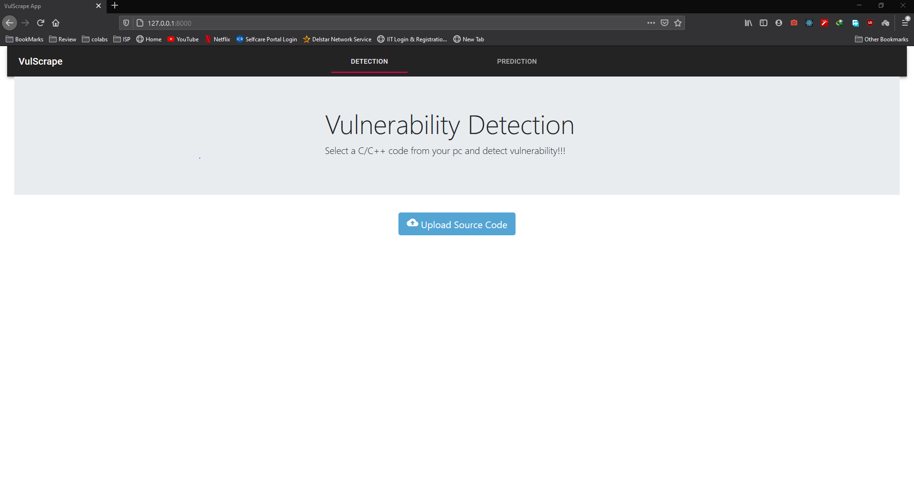
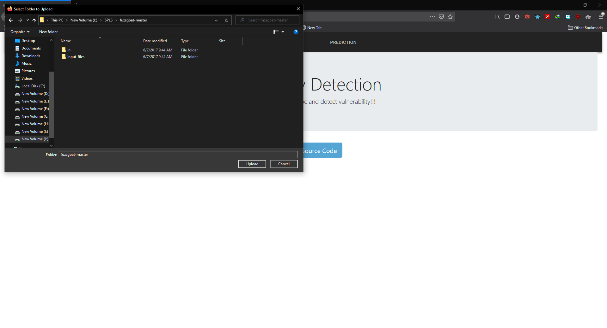
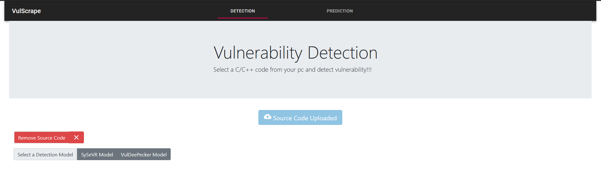
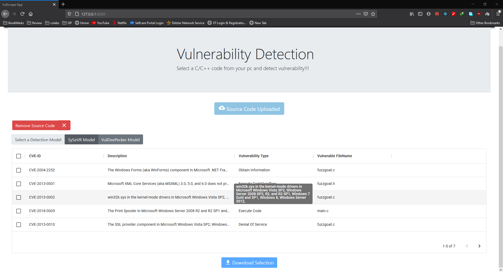
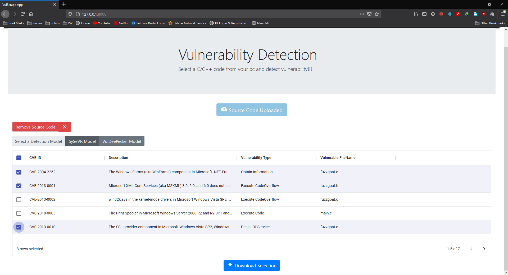
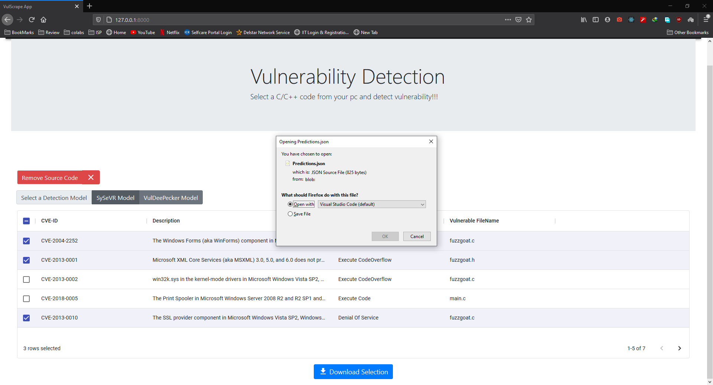
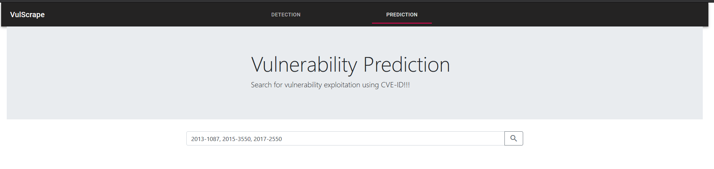
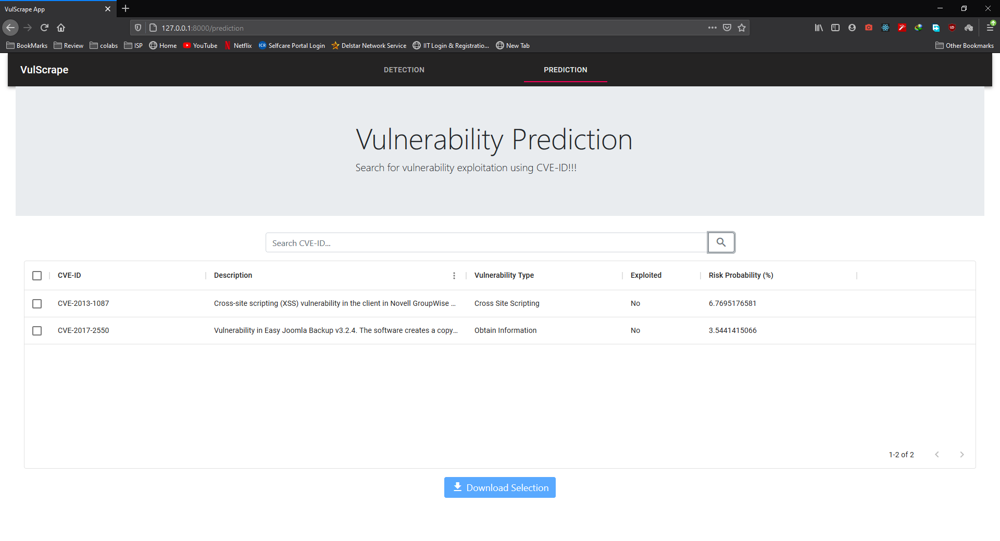
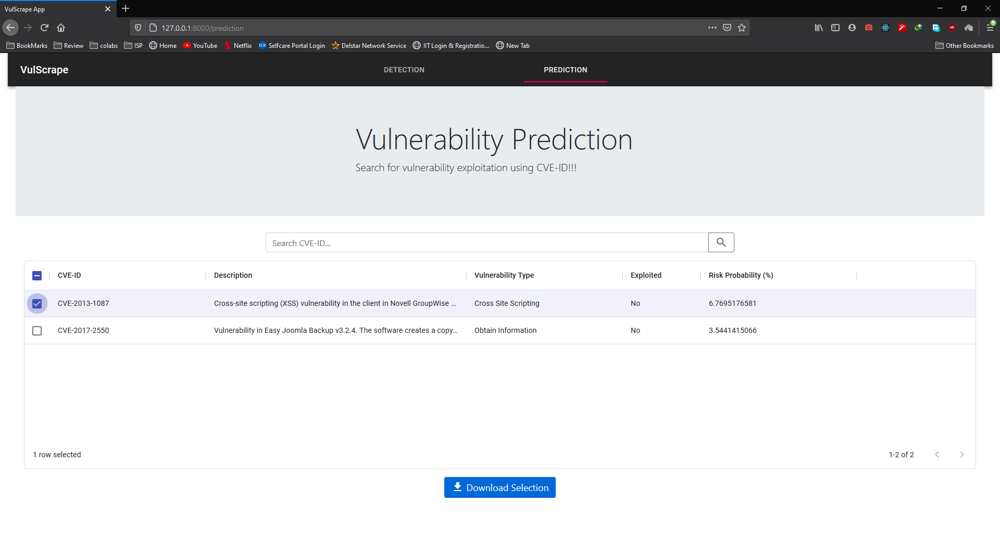
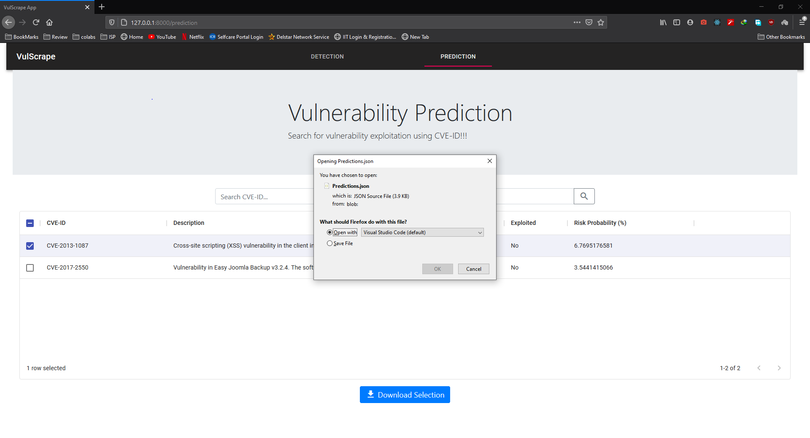

# VulScrape

[](https://www.python.org/downloads/release/python-370/)
[](https://www.django-rest-framework.org/)
[](https://reactjs.org/)
[](https://mui.com/)
[](https://community.chocolatey.org/packages/neo4j-community/2.1.8.20150617#dependencies)
[](https://www.postgresql.org/)
[](https://github.com/tensorflow/tensorflow/releases/tag/v1.14.0-rc1)
[](https://opensource.org/licenses/MIT)

---

### Table of Contents

- [About the project](#about-the-project)
- [Target Users](#target-users)
- [Technologies](#technologies)
- [Web App Demo](#web-app-demo)
- [Getting Started](#getting-started)
- [License](#license)
- [Connect With Me](#connect-with-me)

---

## About The Project

VulScrape is a vulnerability detection & prediction tool for forecasting exploits of common vulnerabilities found in source code written in C/C++. The tool is created as a Google Chrome extension for ease of use. 

This project is inspired by the works of *[Li, Zhen, et al. (2021)](https://ieeexplore.ieee.org/abstract/document/9321538)* & *[Fang, Yong, et al. (2020)](https://journals.plos.org/plosone/article?id=10.1371/journal.pone.0228439)*. The web extension integrates the vulnerability detection methodology from  *Li, Zhen, et al. (2018)* where they used a deep neural network to detect code vulnerabilities and exploit prediction methodology from *Fang, Yong, et al. (2020)*'s ensemble machine learning algorithm.

All vulnerabilities that can be detected by VulScrape are listed under the [National Vulnerability Database](https://nvd.nist.gov/)'s CVE *[listing](https://nvd.nist.gov/vuln/full-listing)*.

<p align="right"><a href="#vulscrape">back to top</a></p>

---

## Technologies

This section describes the essential packages and frameworks used for the project.

- [Python 3.7](https://www.python.org/downloads/release/python-370/)
- [Django 3.1](https://www.djangoproject.com/download/)
- [Joern 0.3](https://joern.io/)
- [Neo4j 2.1.8](https://community.chocolatey.org/packages/neo4j-community/2.1.8.20150617#dependencies)
- [TensorFlow 1.14](https://github.com/tensorflow/tensorflow/releases/tag/v1.14.0-rc1)
- [Gensim 3.8.3](https://pypi.org/project/gensim/3.8.3/)
- [PostgreSQL](https://www.postgresql.org/)
- [React](https://reactjs.org/)
- [Material-UI](https://mui.com/)

<p align="right"><a href="#vulscrape">back to top</a></p>

---

## Web App Demo

<table style="width:100%" class="center">
  <tr>
    <th colspan =  "100%">Pick the detection module and find vulnerabilities from your code!!</th>
  </tr>
  <tr>
    <td></td>
    <td></td>
  </tr>
  <tr>
    <th colspan =  "100%">Detect vulnerability as using any one of the two models!</th>
  </tr>
  <tr>
    <td></td>
    <td></td>
  </tr>
  <tr>
    <th colspan =  "100%">Convenient storage option for the detailed report!</th>
  </tr>
  <tr>
    <td></td>
    <td></td>
  </tr>
  <tr>
    <th colspan =  "100%">Predict exploits for any detected vulnerabilities using their IDs!</th>
  </tr>
  <tr>
    <td></td>
    <td></td>
  </tr>
  <tr>
    <th colspan =  "100%">Save the risk of any exploit for future reference...</th>
  </tr>
  <tr>
    <td></td>
    <td></td>
  </tr>
</table>

<p align="right"><a href="#partocalc">back to top</a></p>

---

## Getting Started
### Installation

1. Download the compressed extension from [here](https://github.com/Saleh-Ibtasham/VulScrape/releases/tag/add-on).
2. Extract the extension with [WinRAR](https://www.win-rar.com/start.html?&L=0) or [7zip](https://www.7-zip.org/).
3. Load the extension from Google Chrome's manage extensions option.
4. Clone the project repo
    > `git clone https://github.com/Saleh-Ibtasham/VulScrape.git`

### Usage
1. Specify the ".joernIndex" folder in joern
2. Turn on Joern and Neo4j database locally
3. Run the downloaded Django project repo in the background
4. Open the extension in Google Chrome

    *For detailed extension instructions, please refer to the user manual section at the end of the [Documentation](https://github.com/Saleh-Ibtasham/VulScrape/blob/master/documentation/VuleScrape_documentation.pdf)*

<p align="right"><a href="#vulscrape">back to top</a></p>

---

## Acknowledgements
Included here are the projects that inspired this work:

1. [SySeVR](https://github.com/SySeVR/SySeVR)
2. [VulDeePecker](https://github.com/CGCL-codes/VulDeePecker)

<p align="right"><a href="#vulscrape">back to top</a></p>

---

## License

```
Copyright 2021 Md Saleh Ibtasham

Permission is hereby granted, free of charge, to any person obtaining a copy of this software and associated documentation files (the "Software"), to deal in the Software without restriction, including without limitation the rights to use, copy, modify, merge, publish, distribute, sublicense, and/or sell copies of the Software, and to permit persons to whom the Software is furnished to do so, subject to the following conditions:

The above copyright notice and this permission notice shall be included in all copies or substantial portions of the Software.

THE SOFTWARE IS PROVIDED "AS IS", WITHOUT WARRANTY OF ANY KIND, EXPRESS OR IMPLIED, INCLUDING BUT NOT LIMITED TO THE WARRANTIES OF MERCHANTABILITY, FITNESS FOR A PARTICULAR PURPOSE AND NONINFRINGEMENT. IN NO EVENT SHALL THE AUTHORS OR COPYRIGHT HOLDERS BE LIABLE FOR ANY CLAIM, DAMAGES OR OTHER LIABILITY, WHETHER IN AN ACTION OF CONTRACT, TORT OR OTHERWISE, ARISING FROM, OUT OF OR IN CONNECTION WITH THE SOFTWARE OR THE USE OR OTHER DEALINGS IN THE SOFTWARE.
```

<p align="right"><a href="#vulscrape">back to top</a></p>

---

## Connect With Me

[][website]
[][linkedin]

<p align="right"><a href="#vulscrape">back to top</a></p>


[website]: https://sites.google.com/view/md-saleh-ibtasham/home
[linkedin]: https://www.linkedin.com/in/saleh-ibtasham/